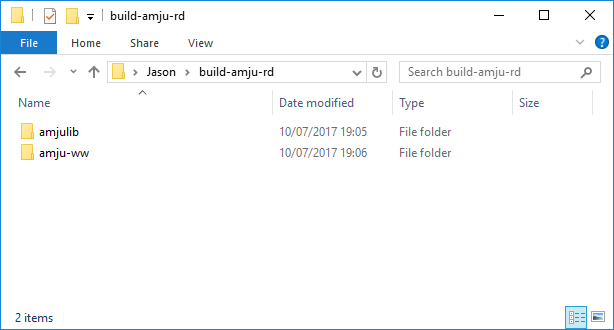
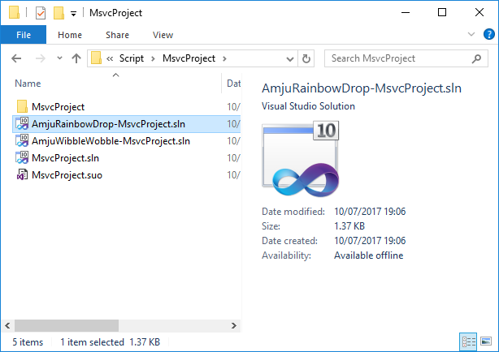

# Amju Rainbow Drop
Amju Rainbow Drop game for iOS, Mac, Win, Wii

On the iOS App Store: https://itunes.apple.com/us/app/amju-rainbow-drop/id866202023?mt=8

   

This game was originally called Amju Wibble Wobble, which is why this repo is called amju-ww, and there are some other references to 'WW' in the code.

## Building and running on Windows

1. This game depends on amjulib, which is my game engine library. You need to clone amju-ww and amjulib into the same dir, e.g.:

2. Go to amju-ww/Script/MsvcProject and open AmjuRainbowDrop-MsvcProject.sln in <b>Microsoft Visual Studio 2017</b>.

3. Build and run with F5.

